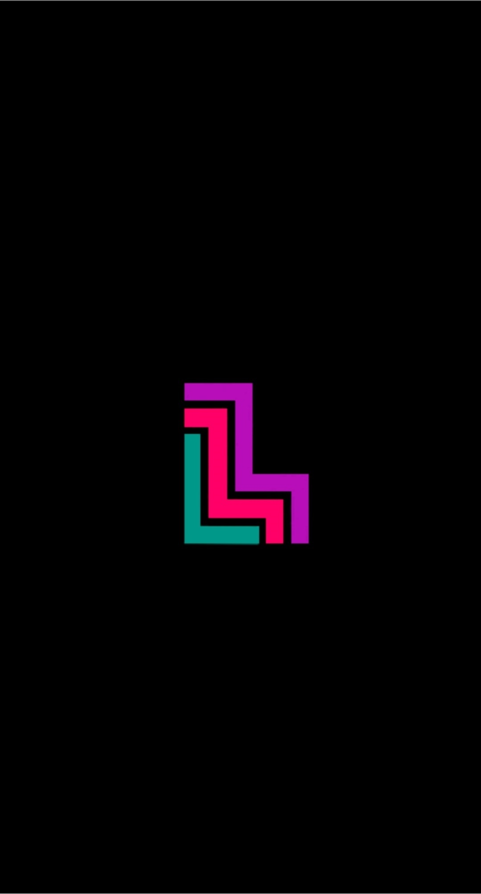
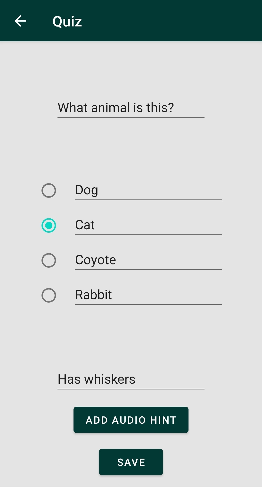
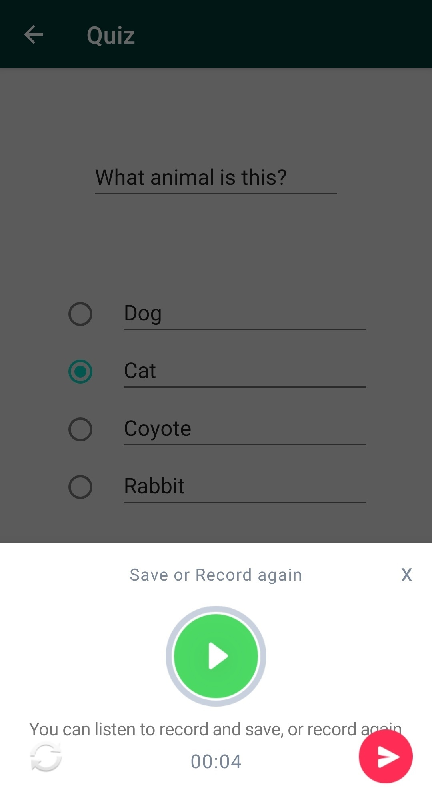
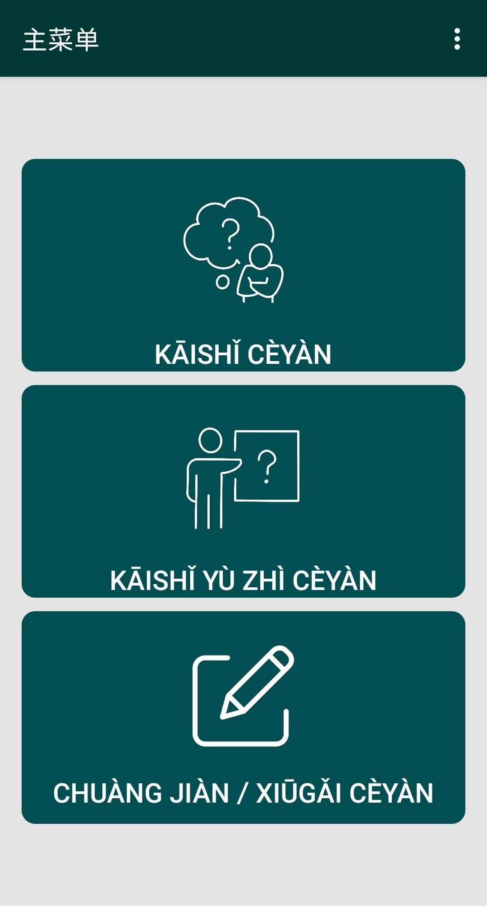
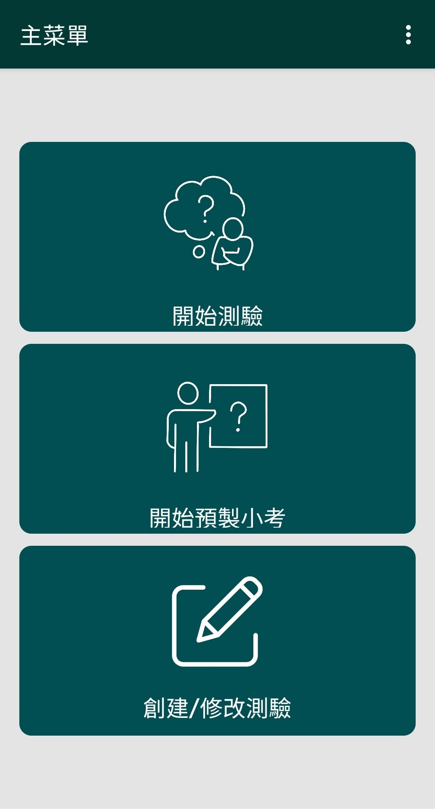
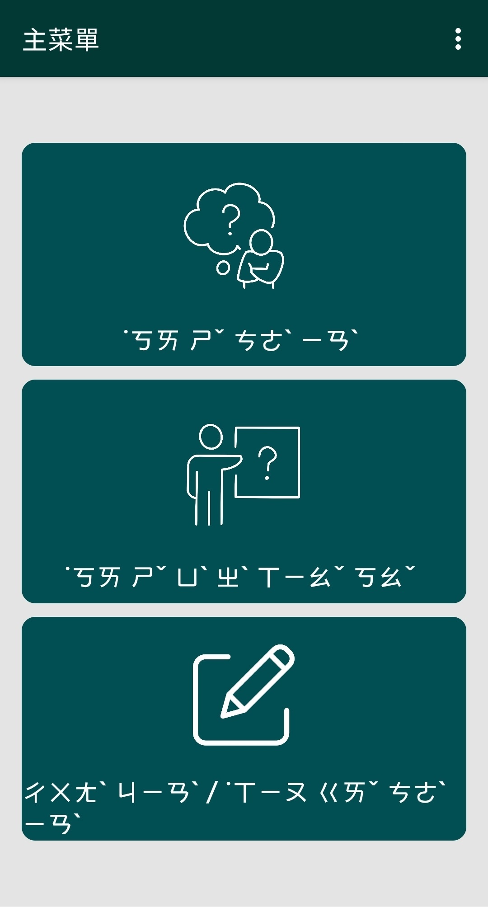
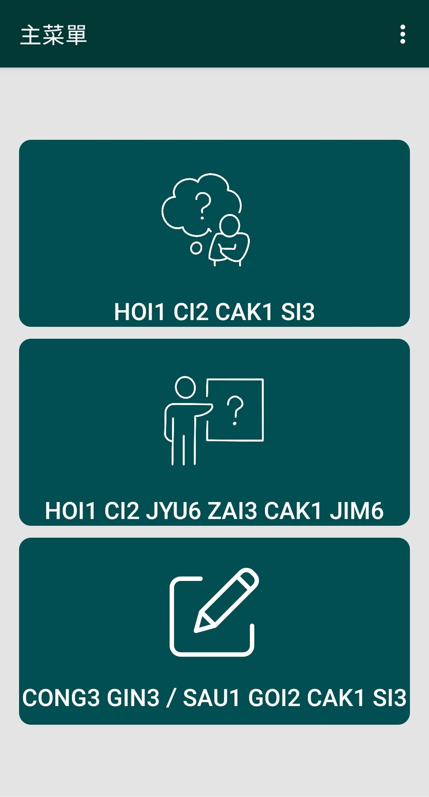

<!-- PROJECT LOGO -->
 

  
  
# Memory Lane

**A trip to the Past**

<!-- PROJECT SHIELDS -->
[![Contributors][contributors-badge]][contributors]
[![Release][release-badge]][release]

An Android mobile application that uses quiz-like exercises to provide reminiscence therapy for people with dementia.

[apk File][apk-file] •
[Source File][source-file]

---

<!-- TABLE OF CONTENTS -->

  
Table of Contents

  <ol>
    <li>
      <a href="#about-the-project">About The Project</a>
      <ul>
        <li><a href="#built-with">Built With</a></li>
      </ul>
    </li>
    <li>
      <a href="#features">Features</a>
      <ul>
        <li><a href="#quiz">Quiz</a></li>
        <li><a href="#text-to-speech">Text-to-speech</a></li>
        <li>
          <a href="#questions-creation">Questions Creation</a>
          <ul>
            <li><a href="#audio-recorder">Audio Recorder</a></li>
          </ul>
        </li>
        <li><a href="#database">Database</a></li>
        <li><a href="#multi-language-support">Multi-language Support</a></li>
        <li><a href="#transliteration">Transliteration</a></li>
        <li><a href="#spaced-repetition">Spaced Repetition</a></li>
      </ul>
    </li>
    <li><a href="#contributors">Contributors</a></li>
    <li><a href="#acknowledgements">Acknowledgements</a></li>
  </ol>

<!-- ABOUT THE PROJECT -->
## About The Project

Memory Lane is the final project created by members of the ItJustWorks team for the course in Introduction to Software Engineering in the Summer semester of 2022. The theme of the course was agile software development in three sprints of the Android mobile application that should enhance the lives of people diagnosed with dementia, particularly the elderly.

The mobile application aims to enhance the quality of everyday life of people with dementia (PWD) by using reminiscence therapy. The purpose of reminiscence therapy is to help PWD recall moments of their past and the times spent with close friends, family members, and caregivers. This therapy has been shown to improve the quality of life in PWD by reducing stress, increasing their self-esteem, and helping them reconnect with memories of their life.

Memory Lane challenges users to recognise randomly chosen images of individuals or memorabilia and strengthen connections with memories pertaining to these individuals or memorabilia through questions presented in the application. By doing so, the application aims to reduce cognitive decline while achieving the benefits of reminiscence therapy.

### Built With

* [![Firebase][firebase-badge]][firebase]

<!-- FEATURES -->
## Features

### Quiz

The main part of the application is the quiz. The quiz is designed to help users become more familiar with people and objects that are part of their lives. The quiz consists of question sets, each of which contains 5 questions, an image, and a video. The questions are all related to the image in the question set and are designed to help users reconnect with their memories connected with a certain person shown in the image. Each question has 4 options and a hint that is provided through audio if the user does not answer the question correctly or after the user clicks on the hint button in the top right corner if they find the question too difficult to answer. If the user chooses an incorrect option, it will be removed from the screen and they will have another try to get the question correct. Users can make as many mistakes as they want until there is only one option remaining.

After users have answered all the questions related to an image, a video will play that further reconnects them with the key object of the current question set. Then, the application will move on to the next question set with new images, videos, and audio files for each of the questions in a question set. The volume of the video can be easily adjusted through the volume slider on the app UI without users having to reach for their mobile device's side buttons.

The quiz continues until there are no more unanswered question sets or until users decide to go back to the main menu of the app.

### Text-to-speech

To ensure that the application supports those with moderate to moderately severe dementia who have difficulties reading, text-to-speech (TTS) is implemented in the app. The TTS reads out all questions and answers options as users complete the quiz. When TTS is reading options, corresponding buttons are highlighted to indicate which button to press to select the option. Users can hold down the option button to have the TTS read out that option again or click on the question text box to repeat the question. The feature is implemented by utilising Google's free Cloud Text-to-Speech service.

### Questions Creation

To modify the quiz, the user needs to provide an image, a video, and five questions for each question set. If any of the required information is missing, the question set will be saved as a draft until all the information is provided. The user can upload data from files saved on the mobile phone or use the image recorder, video recorder, and audio recorder features of the app to obtain the data. The [Image Picker][imagepicker] library was used to implement the Image Recorder feature.

#### Audio Recorder

Users can upload an audio file from their mobile phone or record it with an in-app audio recorder. To record audio, the user should hold down the main button and speak. After releasing the button, the file will be automatically saved on the phone's memory. The user can then choose to save the audio file, record again, or discard any changes made by the recorder and keep the previous audio file (if one was uploaded previously), or keep the field empty (if it was empty before).

### Database

App stores the information provided during the creation of the quiz on a Firebase Realtime Database. The database can hold various data types such as mp3, mp4, jpg, and png. The application requires access to the internet to fetch the data from the database. If there is no web connection, the user won't be able to do the quiz.

### Multi-language Support

To ensure that the application is accessible throughout Canada, it includes the top 5 spoken languages in Canada:

- English
- French
- Mandarin (Simplified, Traditional)
- Cantonese (Traditional)
- Punjabi (Gurmukhi)

### Transliteration

To help Chinese speakers who are having trouble reading Chinese characters use the application more easily, the user can enable the transliteration of Chinese characters in settings. The application supports transliteration of both Mandarin and Cantonese and selects the transliteration system based on the default language of the operating system.

- Chinese, Mainland -> Hanyu Pinyin
- Chinese, Taiwan -> Zhuyin Fuhao
- Chinese, Hong Kong / Chinese, Macau -> Jyutping

#### Mandarin Simplified -> Pinyin

#### Mandarin Traditional -> Zhuyin

#### Cantonese -> Jyutping

### Spaced Repetition

The order in which question sets are presented to the user upon starting the quiz is determined by Spaced repetition learning technique. This technique presents question sets that were erroneously recognised in past iterations based on the quiz's outcomes, giving the user extra opportunities to become familiar with the object of the question sets. The feature is implemented by storing weights for each item on the database and recalculating them during the process of completing the quiz.

The user can view a pie chart that shows which question sets they recognise best. The [MPAndroidChart][androidchart] library was used to implement the Analysis feature.

<!-- CONTRIBUTION -->
## Contributors

- Andrei Harbachov ([GitHub][andrei-github] · [LinkedIn][andrei-linkedin])
- Felicia Samatha ([GitHub][felicia-github])
- Karanbir Singh
- Yuling Su
- Yulong (Lucas) Wu ([LinkedIn][lucas-linkedin])

<!-- ACKNOWLEDGEMENTS -->
## Acknowledgements

- [MPAndroidChart][androidchart] - used to generate a pie chart for the Randomisation Algorithm analysis
- [Image Picker][imagepicker] - used to enable users uploading and editing images for the Questions Creation

<!-- MARKDOWN LINKS -->
[contributors-badge]: https://img.shields.io/badge/Contributors-5-44cc11?style=for-the-badge
[contributors]: #contributors
[release-badge]: https://img.shields.io/github/v/release/andreihar/memory-lane?color=38618c&style=for-the-badge
[release]: https://github.com/andreihar/memory-lane/releases
[apk-file]: https://github.com/andreihar/memory-lane/releases/download/v4.0.0/memory-lane.apk
[source-file]: https://github.com/andreihar/memory-lane/archive/refs/tags/v4.0.0.zip
[firebase-badge]: https://img.shields.io/badge/Firebase-4c4c4c?style=for-the-badge&logo=firebase&logoColor=23039BE5
[firebase]: https://firebase.google.com/
[androidchart]: https://github.com/PhilJay/MPAndroidChart
[imagepicker]: https://github.com/Dhaval2404/ImagePicker

[andrei-github]: https://github.com/andreihar
[andrei-linkedin]: https://www.linkedin.com/in/andreihar/
[felicia-github]: https://github.com/felisamatha
[lucas-linkedin]: https://www.linkedin.com/in/luk23/